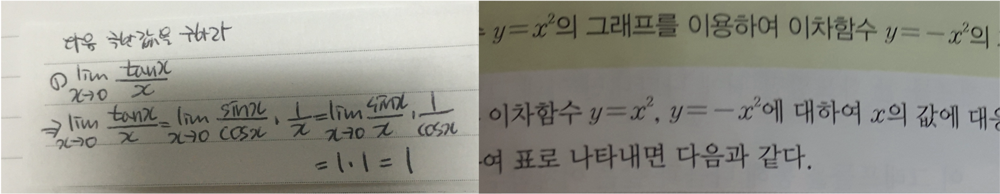

#### This dataset is created by NAVER Connect Foundation. 
# 수학 수식 OCR 데이터셋

## Overview
해당 데이터셋은 인쇄물과 손글씨 수식 데이터를 기반으로 하여 만들어졌습니다. 
수식 이미지와 그에 대응하는 latex 수식, 학업 난이도 쌍으로 구성되어 있습니다.

<br>

## 목차
1. 데이터셋 설명
2. 전처리 과정 
3. 데이터셋 훑어보기
4. 라이센스

<br>
<br>

## 1. 데이터셋 설명
10만개의 학습용 데이터와 9000개의 평가용 데이터로 구성되어 있습니다.

```
[dataset]/
├── train_dataset
│   ├── gt.txt
│   ├── level.txt
│   ├── source.txt
│   ├── tokens.txt
│   └── images/
│       ├── *.jpg
│       ├── ...     
│       └── *.jpg
└── eval_dataset
    ├── gt.txt
    ├── level.txt
    ├── source.txt
    ├── tokens.txt
    └── images/
        ├── *.jpg
        ├── ...     
        └── *.jpg
```

- gt.txt 
    - 수식 이미지의 latex ground truth가 작성되어 있는 파일입니다.
- level.txt
    - 수식 이미지의 academic level 정보가 작성되어 있는 파일입니다.
    - 1(초등), 2(중등),3(고등), 4(대학)
- source.txt
    - 수식 이미지의 source 정보가 작성되어 있는 파일입니다.
    - 1(손글씨), 0(인쇄물)
- tokens.txt
    - latex ground truth를 기반으로 작성된 token 정보가 작성되어 있는 파일입니다.

<br>

## 2. 전처리 과정 
- 2.1 수식 이미지 
    - Bounding box detect 후 텍스트 방향에 맞게 정렬하여 편집합니다.
- 2.2 수식 텍스트
    - 모든 토큰은 빈칸으로 분리합니다.
        - 토큰: latex 최소 유닛, latex 특수기호, 알파벳, 숫자
        - 예) ‘\frac, ‘{‘, ‘}’, ‘2’, ‘a’, ‘b’, ‘^’
    - 묶을 수 있으면 { } 로 그룹화합니다.
        - 예) ^ { }, _ { }, \frac { } { }, \sqrt { }, ...
        - 그룹 순서
            - _ → ^
            - 예) \int _ { 1 } ^ { e }
    - 표기 방법
        - { }는 Rule 2에서처럼 그룹을 표기할 때 사용됨. 그래서 수학 기호로 사용할 때(예: A = {1,2,3})는 그룹화 표기 { }와 구분하기 위해서 \{ \}로 타이핑하고 저장할 때 \{ \}를 \left\{ \right\}로 바꾸도록 한다.
        - (), [], || 기호들은 해당사항 없음.


<br>

## 3. 데이터셋 특징

해당 데이터 셋은 real world에서 사용되는 손글씨, 인쇄물 이미지를 가공하여 제작되었습니다.
그렇기 때문에 합성 데이터와는 달리 빛의 조도, 사진이 찍힌 각도등과 같은 부분들도 데이터에 반영되어 있습니다.
또한, latex 수식뿐만 아니라, 학업 수준에 따른 레이블, 수식 이미지의 source 정보 또한 포함되어 있어서, 다양한 정보를 활용하여 수식인식 연구, 개발을 진행할 수 있습니다.


실제 raw data 중 일부를 캡쳐한 사진입니다.


## 3. 데이터셋 훑어보기
    $ head  train_dataset/gt.txt
    train_00000.jpg 4 \times 7 = 2 8
    train_00001.jpg a ^ { x } > q
    train_00002.jpg 8 \times 9
    train_00003.jpg \sum _ { k = 1 } ^ { n - 1 } b _ { k } = a _ { n } - a _ { 1 }
    train_00004.jpg I = d q / d t
    train_00005.jpg \sum \overrightarrow { F } _ { e x t } = d
    train_00006.jpg i ^ { 2 } = - 1 \left( i = \sqrt { - 1 } \right)
    train_00007.jpg 7 \times 9 = 4 9
    train_00008.jpg F \left( 0 , \sqrt { a ^ { 2 } + b ^ { 2 } } \right) , \left( 0 , - \sqrt { a ^ { 2 } + b ^ { 2 } } \right)
    train_00009.jpg \left( a - 2 \right) \left( a - 3 \right) = 0

<br>

    $ head train_dataset/level.txt
    train_00000.jpg 1
    train_00001.jpg 2
    train_00002.jpg 2
    train_00003.jpg 3
    train_00004.jpg 4
    train_00005.jpg 4
    train_00006.jpg 2
    train_00007.jpg 1
    train_00008.jpg 3
    train_00009.jpg 2

<br>

    $ head train_dataset/source.txt
    train_00000.jpg 1
    train_00001.jpg 0
    train_00002.jpg 0
    train_00003.jpg 1
    train_00004.jpg 0
    train_00005.jpg 0
    train_00006.jpg 0
    train_00007.jpg 1
    train_00008.jpg 1
    train_00009.jpg 1

<br>

    $ head train_dataset/tokens.txt
    O
    \prod
    \downarrow
    \widehat
    \iiint
    \ddot
    \supsetneq
    _
    \log
    \dot

<br>


## 4. 라이센스
<a rel="license" href="http://creativecommons.org/licenses/by/4.0/"></a><br />This work is licensed under a <a rel="license" href="http://creativecommons.org/licenses/by/4.0/">Creative Commons Attribution 4.0 International License</a>.
<br>
